# 🏢 API Greg - Guide Complet pour le Développement Frontend

## 📊 Vue d'ensemble

L'API Greg est un système de gestion d'espaces, de documents, d'utilisateurs et
de workflows orienté vers la planification et la coordination d'équipes. Elle
gère des **espaces de travail**, des **documents** associés, des
**utilisateurs**, des **rappels** et des **équipes** (shifts).

## 🎯 Entités Principales

### 1. 🏢 **Spaces** (Espaces)

**Endpoint base :** `/api/greg/spaces`

Les espaces représentent des lieux physiques ou logiques (bureaux, salles,
zones).

```typescript
interface Space {
  space_id: string;
  space_name?: string;
  type?: string; // Ex: "ROOM", "OFFICE", "ZONE"
  notes?: string;
}
```

**Opérations :**

- `GET /api/greg/spaces` - Lister tous les espaces (filtrage par `space_type`)
- `POST /api/greg/spaces` - Créer un nouvel espace
- `GET /api/greg/spaces/{space_id}` - Détails d'un espace
- `PUT /api/greg/spaces/{space_id}` - Modifier un espace
- `DELETE /api/greg/spaces/{space_id}` - Supprimer un espace

### 2. 📄 **Documents**

**Endpoint base :** `/api/greg/documents`

Les documents sont des ressources liées à des feuilles de calcul Google Sheets.

```typescript
interface Document {
  id: string;
  spreadsheet_name: string;
  sheet_name: string;
  summary?: string;
  categories?: string;
  pending_for_review?: boolean;
}
```

**Opérations :**

- `GET /api/greg/documents` - Lister tous les documents
- `POST /api/greg/documents` - Créer un nouveau document
- `GET /api/greg/documents/pending` - Documents en attente de révision
- `GET /api/greg/documents/{document_id}` - Détails d'un document
- `PUT /api/greg/documents/{document_id}` - Modifier un document
- `DELETE /api/greg/documents/{document_id}` - Supprimer un document

### 3. 👤 **Users** (Utilisateurs)

**Endpoint base :** `/api/greg/users`

Les utilisateurs du système avec leurs préférences et paramètres.

```typescript
interface User {
  user_id: string;
  name: string;
  mail: string;
  source_prefere?: string;
  custom_instruction?: string;
  frequence_utilisation?: number;
  verbose?: boolean;
  sources?: boolean;
  rn?: number;
  created_at?: string;
  updated_at?: string;
}
```

**Opérations :**

- `GET /api/greg/users` - Lister tous les utilisateurs (filtrage par
  `source_prefere`, `verbose`)
- `POST /api/greg/users` - Créer un nouvel utilisateur
- `GET /api/greg/users/{user_id}` - Détails d'un utilisateur
- `PUT /api/greg/users/{user_id}` - Modifier un utilisateur
- `DELETE /api/greg/users/{user_id}` - Supprimer un utilisateur

### 4. ⏰ **Reminders** (Rappels)

**Endpoint base :** `/api/greg/reminders`

Système de rappels liés aux espaces et utilisateurs.

```typescript
interface Reminder {
  id: string;
  message: string;
  user_id: string;
  target_space_id: string;
  source_space_id?: string;
  status: string;
  remind_at: string; // ISO datetime
  created_at?: string;
  updated_at?: string;
}
```

**Opérations :**

- `GET /api/greg/reminders` - Lister tous les rappels (filtrage par `status`,
  `user_id`)
- `POST /api/greg/reminders` - Créer un nouveau rappel
- `GET /api/greg/reminders/{reminder_id}` - Détails d'un rappel
- `PUT /api/greg/reminders/{reminder_id}` - Modifier un rappel
- `DELETE /api/greg/reminders/{reminder_id}` - Supprimer un rappel

### 5. 👥 **Shifts** (Équipes/Services)

**Endpoint base :** `/api/greg/shifts`

Planification des équipes sur des créneaux horaires dans des espaces.

```typescript
interface Shift {
  id: string;
  space_id: string;
  start_time: string; // ISO datetime
  end_time: string; // ISO datetime
  content?: string;
  capacity?: number;
  location?: string;
  created_at?: string;
}
```

**Opérations :**

- `GET /api/greg/shifts` - Lister toutes les équipes (filtrage par `space_id`)
- `POST /api/greg/shifts` - Créer une nouvelle équipe
- `GET /api/greg/shifts/{shift_id}` - Détails d'une équipe
- `PUT /api/greg/shifts/{shift_id}` - Modifier une équipe
- `DELETE /api/greg/shifts/{shift_id}` - Supprimer une équipe

### 6. 🏷️ **Categories** (Catégories)

**Endpoint base :** `/api/greg/categories`

Classification des documents par catégories.

```typescript
interface Category {
  id: string;
  name: string;
  description: string;
  created_at?: string;
  updated_at?: string;
}
```

**Opérations :**

- `GET /api/greg/categories` - Lister toutes les catégories
- `POST /api/greg/categories` - Créer une nouvelle catégorie
- `DELETE /api/greg/categories/{category_id}` - Supprimer une catégorie

## 🔗 Relations et Accès

### 📋 **Space-Document Access**

**Endpoint base :** `/api/greg/space-document-access`

Gère quels documents sont accessibles depuis quels espaces.

```typescript
interface SpaceDocumentAccess {
  space_id: string;
  document_id: string;
  granted_at: string; // ISO datetime
}
```

**Opérations :**

- `GET /api/greg/space-document-access` - Lister tous les accès
- `POST /api/greg/space-document-access` - Créer un accès document-espace
- `DELETE /api/greg/space-document-access` - Supprimer un accès
- `GET /api/greg/space-document-access/document/{document_id}` - Espaces ayant
  accès à un document
- `GET /api/greg/space-document-access/space/{space_id}` - Documents accessibles
  depuis un espace

### 🔄 **Space-History Access**

**Endpoint base :** `/api/greg/space-history-access`

Gère l'accès aux historiques d'autres espaces.

```typescript
interface SpaceHistoryAccess {
  source_space_id: string;
  target_space_id: string;
  granted_at: string;
  notes?: string;
}
```

**Opérations :**

- `GET /api/greg/space-history-access` - Lister tous les accès historiques
- `POST /api/greg/space-history-access` - Créer un accès historique
- `DELETE /api/greg/space-history-access` - Supprimer un accès historique
- `GET /api/greg/space-history-access/{space_id}` - Accès historiques d'un
  espace

### 🔧 **Actions d'Assignation**

**Assigner des documents à un espace :**
`POST /api/greg/spaces/{space_id}/assign-documents`

```typescript
interface AssignDocumentsPayload {
  document_ids: string[];
}
```

**Assigner l'accès historique à un espace :**
`POST /api/greg/spaces/{space_id}/assign-history-access`

```typescript
interface AssignHistoryAccessPayload {
  target_space_ids: string[];
  notes?: Record<string, string>;
}
```

## 📊 Diagramme des Relations

```mermaid
graph TB
    User[👤 User]
    Space[🏢 Space]
    Document[📄 Document]
    Category[🏷️ Category]
    Reminder[⏰ Reminder]
    Shift[👥 Shift]

    %% Relations principales
    User -->|crée| Reminder
    Reminder -->|concerne| Space
    Reminder -->|source depuis| Space

    Shift -->|planifiée dans| Space

    Document -.->|classé par| Category

    %% Relations d'accès (tables de liaison)
    Space -.->|SpaceDocumentAccess| Document
    Space -.->|SpaceHistoryAccess| Space

    %% Annotations
    User -.->|user_id| Reminder
    Space -.->|space_id| Shift
    Space -.->|target_space_id| Reminder
    Space -.->|source_space_id| Reminder
```



## 🎯 Cas d'Usage Typiques

### 1. **Gestion d'un Espace de Travail**

```typescript
// 1. Créer un espace
const space = await createSpace({
  space_id: 'office-01',
  space_name: 'Bureau Principal',
  type: 'OFFICE',
});

// 2. Lui assigner des documents
await assignDocumentsToSpace('office-01', {
  document_ids: ['doc-1', 'doc-2', 'doc-3'],
});

// 3. Créer une équipe dans cet espace
await createShift({
  space_id: 'office-01',
  start_time: '2025-01-20T09:00:00Z',
  end_time: '2025-01-20T17:00:00Z',
  content: 'Équipe du matin',
});
```

### 2. **Workflow de Rappels**

```typescript
// 1. Créer un rappel pour un utilisateur
const reminder = await createReminder({
  message: "Vérifier l'équipement de la salle",
  user_id: 'user-123',
  target_space_id: 'room-a1',
  status: 'PENDING',
  remind_at: '2025-01-20T14:00:00Z',
});

// 2. Récupérer les rappels d'un utilisateur
const userReminders = await getReminders({
  user_id: 'user-123',
  status: 'PENDING',
});
```

### 3. **Gestion des Documents**

```typescript
// 1. Créer un document
const document = await createDocument({
  spreadsheet_name: 'Planning Équipes',
  sheet_name: 'Janvier 2025',
  summary: 'Planning des équipes pour janvier',
  categories: 'planning,équipes',
});

// 2. Voir quels espaces y ont accès
const accessibleSpaces = await getSpacesForDocument(document.id);
```

## 🛠️ Interfaces TypeScript pour le Frontend

### **API Client Base**

```typescript
// Configuration de base
interface ApiConfig {
  baseUrl: string;
  apiKey: string;
}

// Réponses d'erreur standardisées
interface ApiError {
  error: string;
  details?: any;
}

// Pagination (si nécessaire)
interface PaginatedResponse<T> {
  data: T[];
  total: number;
  page: number;
  limit: number;
}
```

### **Hooks React Query Recommandés**

```typescript
// Hooks pour les espaces
export const useSpaces = (spaceType?: string) => {
  return useQuery({
    queryKey: ['spaces', spaceType],
    queryFn: () => api.getSpaces({ space_type: spaceType }),
  });
};

export const useSpace = (spaceId: string) => {
  return useQuery({
    queryKey: ['space', spaceId],
    queryFn: () => api.getSpace(spaceId),
  });
};

export const useCreateSpace = () => {
  const queryClient = useQueryClient();
  return useMutation({
    mutationFn: api.createSpace,
    onSuccess: () => {
      queryClient.invalidateQueries({ queryKey: ['spaces'] });
    },
  });
};

// Hooks pour les documents
export const useDocuments = () => {
  return useQuery({
    queryKey: ['documents'],
    queryFn: api.getDocuments,
  });
};

export const useDocumentsForSpace = (spaceId: string) => {
  return useQuery({
    queryKey: ['space-documents', spaceId],
    queryFn: () => api.getDocumentsForSpace(spaceId),
  });
};

// Hooks pour les rappels
export const useReminders = (filters?: {
  status?: string;
  user_id?: string;
}) => {
  return useQuery({
    queryKey: ['reminders', filters],
    queryFn: () => api.getReminders(filters),
  });
};

export const useCreateReminder = () => {
  const queryClient = useQueryClient();
  return useMutation({
    mutationFn: api.createReminder,
    onSuccess: () => {
      queryClient.invalidateQueries({ queryKey: ['reminders'] });
    },
  });
};
```

### **Services API**

```typescript
export class GregApiService {
  constructor(private config: ApiConfig) {}

  // Espaces
  async getSpaces(params?: { space_type?: string }): Promise<Space[]> {
    // Implementation
  }

  async createSpace(
    space: Omit<Space, 'space_id'> & { space_id: string }
  ): Promise<Space> {
    // Implementation
  }

  async assignDocumentsToSpace(
    spaceId: string,
    payload: AssignDocumentsPayload
  ): Promise<void> {
    // Implementation
  }

  // Documents
  async getDocuments(): Promise<Document[]> {
    // Implementation
  }

  async getPendingDocuments(): Promise<Document[]> {
    // Implementation
  }

  // Utilisateurs
  async getUsers(params?: {
    source_prefere?: string;
    verbose?: boolean;
  }): Promise<User[]> {
    // Implementation
  }

  // Rappels
  async getReminders(params?: {
    status?: string;
    user_id?: string;
  }): Promise<Reminder[]> {
    // Implementation
  }

  async createReminder(
    reminder: Omit<Reminder, 'id' | 'created_at' | 'updated_at'>
  ): Promise<Reminder> {
    // Implementation
  }

  // Équipes
  async getShifts(params?: { space_id?: string }): Promise<Shift[]> {
    // Implementation
  }

  // Statistiques
  async getStats(): Promise<{
    total_spaces: number;
    total_documents: number;
    total_users: number;
    total_reminders: number;
    total_shifts: number;
    total_categories: number;
    total_accesses: number;
    timestamp: string;
  }> {
    // Implementation
  }
}
```

## 🔧 Endpoints Utilitaires

### **Health Check**

`GET /api/greg/health` - Vérifier l'état de l'API

### **Statistiques Système**

`GET /api/greg/stats` - Obtenir les métriques globales du système

## 🚦 Statuts de Réponse

| Code  | Description                                        |
| ----- | -------------------------------------------------- |
| `200` | Succès - Opération réalisée                        |
| `201` | Créé - Ressource créée avec succès                 |
| `400` | Mauvaise requête - Données manquantes ou invalides |
| `404` | Non trouvé - Ressource inexistante                 |
| `500` | Erreur serveur - Problème technique                |

## 🔐 Authentification

Toutes les routes nécessitent une authentification via header `X-API-Key` :

```typescript
const headers = {
  'X-API-Key': 'votre-clé-api',
  'Content-Type': 'application/json',
};
```

## 📝 Notes d'Implémentation

1. **Dates** : Toutes les dates sont au format ISO 8601 (UTC)
2. **IDs** : Les identifiants sont des chaînes de caractères
3. **Relations** : Les liens entre entités utilisent des tables de liaison
   explicites
4. **Filtrage** : La plupart des endpoints GET supportent des paramètres de
   filtrage
5. **Pagination** : Non implémentée dans la version actuelle mais recommandée
   pour les listes importantes

---

## 🚀 Guide de Démarrage Rapide

### **Setup Initial**

```typescript
// 1. Installation des dépendances
npm install @tanstack/react-query axios

// 2. Configuration de l'API client
const apiClient = new GregApiService({
  baseUrl: 'https://your-api-domain.com',
  apiKey: process.env.REACT_APP_GREG_API_KEY
});

// 3. Setup React Query
import { QueryClient, QueryClientProvider } from '@tanstack/react-query';

const queryClient = new QueryClient({
  defaultOptions: {
    queries: {
      staleTime: 5 * 60 * 1000, // 5 minutes
      retry: 2
    }
  }
});
```

### **Première Interface - Liste des Espaces**

```typescript
import { useSpaces, useCreateSpace } from './hooks/greg-hooks';

function SpacesList() {
  const { data: spaces, isLoading, error } = useSpaces();
  const createSpace = useCreateSpace();

  const handleCreateSpace = async (formData: any) => {
    try {
      await createSpace.mutateAsync(formData);
      toast.success('Espace créé avec succès !');
    } catch (err) {
      toast.error('Erreur lors de la création');
    }
  };

  if (isLoading) return <LoadingSpinner />;
  if (error) return <ErrorMessage error={error} />;

  return (
    <div className="space-y-4">
      <h2 className="text-2xl font-bold">Espaces de Travail</h2>

      <CreateSpaceForm onSubmit={handleCreateSpace} />

      <div className="grid grid-cols-1 md:grid-cols-2 lg:grid-cols-3 gap-4">
        {spaces?.map(space => (
          <SpaceCard
            key={space.space_id}
            space={space}
            onSelect={() => navigate(`/spaces/${space.space_id}`)}
          />
        ))}
      </div>
    </div>
  );
}
```

### **Dashboard avec Statistiques**

```typescript
function Dashboard() {
  const { data: stats } = useQuery({
    queryKey: ['greg-stats'],
    queryFn: () => apiClient.getStats()
  });

  const metrics = [
    { label: 'Espaces', value: stats?.total_spaces, icon: '🏢' },
    { label: 'Documents', value: stats?.total_documents, icon: '📄' },
    { label: 'Utilisateurs', value: stats?.total_users, icon: '👤' },
    { label: 'Rappels', value: stats?.total_reminders, icon: '⏰' },
  ];

  return (
    <div className="grid grid-cols-2 md:grid-cols-4 gap-4">
      {metrics.map(metric => (
        <MetricCard key={metric.label} {...metric} />
      ))}
    </div>
  );
}
```

## 🎨 Patterns d'Utilisation Avancés

### **1. Recherche et Filtrage Intelligents**

```typescript
function useAdvancedSpaceSearch() {
  const [filters, setFilters] = useState({
    type: '',
    hasDocuments: false,
    hasActiveShifts: false,
  });

  const { data: spaces } = useSpaces(filters.type);
  const { data: spaceDocuments } = useQuery({
    queryKey: ['space-document-access'],
    queryFn: () => apiClient.getSpaceDocumentAccess(),
  });

  const filteredSpaces = useMemo(() => {
    if (!spaces) return [];

    return spaces.filter(space => {
      if (filters.hasDocuments) {
        const hasDoc = spaceDocuments?.some(
          doc => doc.space_id === space.space_id
        );
        if (!hasDoc) return false;
      }

      // Autres filtres...
      return true;
    });
  }, [spaces, spaceDocuments, filters]);

  return { spaces: filteredSpaces, filters, setFilters };
}
```

### **2. Gestion Optimiste des Mutations**

```typescript
function useOptimisticReminder() {
  const queryClient = useQueryClient();

  return useMutation({
    mutationFn: apiClient.createReminder,
    onMutate: async newReminder => {
      // Annuler les requêtes en cours
      await queryClient.cancelQueries({ queryKey: ['reminders'] });

      // Sauvegarder l'état précédent
      const previousReminders = queryClient.getQueryData(['reminders']);

      // Mettre à jour optimistiquement
      queryClient.setQueryData(['reminders'], (old: any[]) => [
        ...old,
        { ...newReminder, id: 'temp-' + Date.now(), status: 'PENDING' },
      ]);

      return { previousReminders };
    },
    onError: (err, newReminder, context) => {
      // Restaurer l'état précédent en cas d'erreur
      queryClient.setQueryData(['reminders'], context?.previousReminders);
    },
    onSettled: () => {
      // Toujours refetch après mutation
      queryClient.invalidateQueries({ queryKey: ['reminders'] });
    },
  });
}
```

### **3. Composant de Planning Intelligent**

```typescript
function SmartScheduler({ spaceId }: { spaceId: string }) {
  const { data: shifts } = useShifts({ space_id: spaceId });
  const { data: reminders } = useReminders({ space_id: spaceId });

  // Combiner les données pour un affichage unifié
  const timelineEvents = useMemo(() => {
    const events = [];

    shifts?.forEach(shift => {
      events.push({
        type: 'shift',
        start: new Date(shift.start_time),
        end: new Date(shift.end_time),
        title: shift.content,
        data: shift
      });
    });

    reminders?.forEach(reminder => {
      events.push({
        type: 'reminder',
        start: new Date(reminder.remind_at),
        title: reminder.message,
        data: reminder
      });
    });

    return events.sort((a, b) => a.start.getTime() - b.start.getTime());
  }, [shifts, reminders]);

  return (
    <Timeline
      events={timelineEvents}
      onEventClick={handleEventClick}
      onSlotClick={handleSlotClick}
    />
  );
}
```

## 🎯 Recommandations pour le Frontend

1. **Utilisez React Query** pour la gestion du cache et des états de loading
2. **Implémentez un système de toasts** pour les feedbacks utilisateur
3. **Gérez les erreurs de façon centralisée** avec un ErrorBoundary
4. **Optimisez les requêtes** en utilisant les filtres disponibles
5. **Implémentez la recherche locale** pour améliorer l'UX sur les grandes
   listes
6. **Utilisez des mutations optimistes** pour une meilleure UX
7. **Cachée intelligemment** les relations entre entités
8. **Implémentez la synchronisation temps réel** si nécessaire

Cette API est conçue pour être flexible et permettre de construire des
interfaces riches pour la gestion d'espaces collaboratifs ! 🚀
