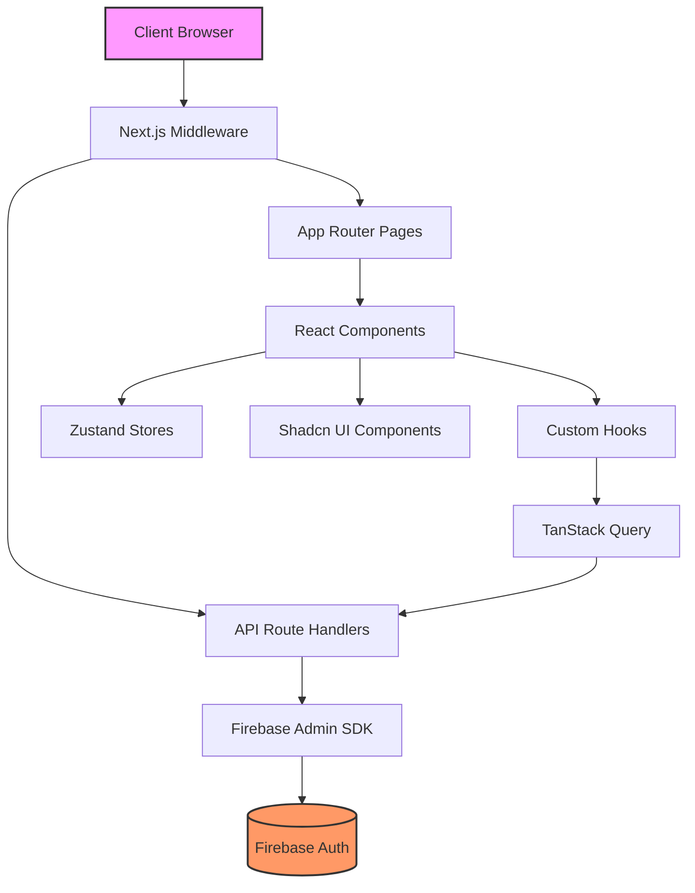

# 🏗️ Architecture du Portail JHMH

## Vue d'ensemble

Le Portail JHMH est une application web moderne construite avec Next.js 15,
utilisant l'App Router pour une meilleure performance et une architecture plus
claire.

## 🔧 Stack Technique

### Core

- **Framework** : Next.js 15.3.4 (App Router)
- **Langage** : TypeScript 5.x (mode strict)
- **Runtime** : Node.js 20+

### Frontend

- **UI Library** : React 19
- **Styling** : TailwindCSS v4 + Shadcn UI
- **Animations** : Framer Motion
- **Thèmes** : next-themes (dark/light mode)

### State Management

- **Server State** : TanStack Query v5 (React Query)
- **Client State** : Zustand
- **Forms** : React Hook Form + Zod

### Backend & Auth

- **Authentication** : Firebase Auth + Admin SDK
- **API** : Next.js Route Handlers
- **Session** : Cookies httpOnly (gérés par middleware)
- **External APIs** : JHMH API pour réservations et actifs

### Outils de développement

- **Linting** : ESLint avec config stricte
- **Formatting** : Prettier
- **Git Hooks** : Husky + lint-staged
- **Type Checking** : TypeScript compiler

## 📐 Architecture en couches



## 🔄 Flux de données

### 1. Authentification

```
Utilisateur → Login (Google OAuth) → Firebase Auth
    ↓
Cookie httpOnly créé → Middleware vérifie → Accès autorisé/refusé
    ↓
useAuth() hook → État utilisateur dans l'app
```

### 2. Fetching de données

```
Component → useQuery hook → API Route Handler
    ↓
Firebase Admin → Validation → Réponse JSON
    ↓
TanStack Query Cache → Re-render optimisé
```

### 3. Mutations

```
Form → React Hook Form → Validation Zod
    ↓
useMutation → API Route → Firebase Update
    ↓
Invalidation cache → UI mise à jour
```

## 🏛️ Structure modulaire

### `/src/app` - Routes et pages

- Organisation par feature avec groupes de routes `(auth)`
- Layouts partagés pour les sections communes
- Loading et error states par défaut

### `/src/components` - Composants réutilisables

- `ui/` : Composants Shadcn (atoms)
- `[feature]/` : Composants métier (molecules/organisms)
- Composition over inheritance

### `/src/hooks` - Logique réutilisable

- Hooks d'authentification (`useAuth`, `useUser`)
- Hooks de données (`useQuery` wrappers)
- Hooks utilitaires

### `/src/lib` - Configurations et utilitaires

- Configuration Firebase (client & admin)
- Helpers et fonctions utilitaires
- Configuration des librairies tierces

### `/src/stores` - État global

- Stores Zustand pour l'UI (modals, toasts)
- Pas de données serveur (géré par React Query)

## 🔒 Sécurité

### Middleware de protection

```typescript
// src/middleware.ts
- Vérifie l'authentification via cookies
- Protège automatiquement /dashboard/*
- Redirige vers /login si non authentifié
- Gestion des rôles via custom claims Firebase
```

### API Routes sécurisées

```typescript
// Toutes les routes API vérifient :
1. Token valide via getAuthenticatedUser()
2. Permissions selon les rôles
3. Validation des inputs avec Zod
```

### Variables d'environnement

```bash
# Public (client-side safe)
NEXT_PUBLIC_FIREBASE_*

# Privées (server-only)
FIREBASE_ADMIN_*
```

## 🚀 Optimisations

### Performance

- **ISR** : Pages statiques régénérées
- **Code Splitting** : Automatique avec App Router
- **Image Optimization** : next/image avec lazy loading
- **Font Optimization** : next/font pour les web fonts

### Caching

- **React Query** : Cache intelligent des données
- **HTTP Cache** : Headers optimisés pour les assets
- **Build Cache** : .next/cache pour les builds rapides

### Bundle Size

- **Tree Shaking** : Imports ES6 optimisés
- **Dynamic Imports** : Pour les grosses dépendances
- **Analyse** : Bundle analyzer en dev

## 📦 Patterns architecturaux

### 1. Container/Presentational

```typescript
// Container : Logique et data fetching
function UserListContainer() {
  const { data } = useUsers();
  return <UserList users={data} />;
}

// Presentational : Pure UI
function UserList({ users }: Props) {
  return <div>{/* UI only */}</div>;
}
```

### 2. Custom Hooks Pattern

```typescript
// Encapsuler la logique complexe
function useAuthenticatedUser() {
  const { user } = useAuth();
  const { data: profile } = useUserProfile(user?.uid);
  return { user, profile };
}
```

### 3. Composition Pattern

```typescript
// Composer des composants flexibles
<Card>
  <CardHeader>
    <CardTitle>Titre</CardTitle>
  </CardHeader>
  <CardContent>Contenu</CardContent>
</Card>
```

## 🔄 Évolutivité

### Horizontal Scaling

- Stateless design (état dans Firebase)
- Compatible avec déploiement multi-instances
- CDN pour les assets statiques

### Vertical Scaling

- Code splitting par route
- Lazy loading des features
- Optimisation des re-renders React

### Maintenance

- Types stricts pour refactoring sûr
- Tests automatisés (à implémenter)
- Documentation à jour

## 📊 Monitoring (À implémenter)

### Performance

- Web Vitals tracking
- Error boundaries avec reporting
- Analytics utilisateur

### Erreurs

- Sentry pour le tracking d'erreurs
- Logs structurés côté serveur
- Alerting sur erreurs critiques
