# 🚀 Workflows de Déploiement - Portail JHMH

## 📋 Vue d'ensemble

Ce document décrit tous les workflows de déploiement automatisés et manuels pour le Portail JHMH, incluant les meilleures pratiques CI/CD avec GitHub Actions.

## 🏗️ Architecture des Workflows

```mermaid
graph TD
    A[Développeur] --> B[Commit sur branche]
    B --> C{Branche?}

    C -->|feature/*| D[PR créée]
    C -->|develop| E[Staging Auto]
    C -->|main| F[Production Auto]

    D --> G[🔍 CI - Quality Checks]
    G --> H[🌐 PR Preview]
    H --> I[🧪 E2E Tests]
    I --> J[💬 PR Comment]

    E --> K[🚧 Staging Workflow]
    K --> L[🧪 Integration Tests]
    L --> M[📊 Staging Report]

    F --> N[🔍 Pre-deployment Checks]
    N --> O[🏗️ Production Build]
    O --> P[🚀 Production Deploy]
    P --> Q[🧪 Post-deployment Tests]
    Q --> R[📢 Notifications]
```



## 🔄 Types de Workflows

### 1. **CI - Quality Checks** (`.github/workflows/ci.yml`)

**Déclencheurs** :

- Push sur `main` ou `develop`
- Pull Requests vers `main` ou `develop`
- Déclenchement manuel

**Fonctionnalités** :

- ✅ **Code Quality** : ESLint, Prettier, TypeScript
- 🏗️ **Build & Test** : Multi-version Node.js (18, 20)
- 🔒 **Functions Validation** : Tests Python, compilation
- 🔐 **Security Audit** : npm audit, vulnérabilités
- 📊 **Code Metrics** : Bundle size, performance

**Durée** : ~8-12 minutes

### 2. **PR Preview & Validation** (`.github/workflows/firebase-hosting-pull-request.yml`)

**Déclencheurs** :

- Ouverture, synchronisation, réouverture de PR

**Fonctionnalités** :

- ⚡ **Quick Validation** : Feedback immédiat (ESLint, TypeScript)
- 🏗️ **Build Complete** : Build avec cache intelligent
- 🔒 **Functions Validation** : Tests complets Python
- 🌐 **Preview Deployment** : URL de preview temporaire (7 jours)
- 🧪 **E2E Tests** : Tests sur l'environnement de preview
- 📊 **Performance Analysis** : Lighthouse CI
- 💬 **PR Comments** : Résumé automatique avec métriques

**Durée** : ~15-20 minutes

### 3. **Staging Deployment** (`.github/workflows/staging.yml`)

**Déclencheurs** :

- Push sur `develop`
- Déclenchement manuel avec options

**Fonctionnalités** :

- 🔍 **Pre-staging Validation** : Suite complète de tests
- 🔒 **Security Tests** : Tests de sécurité avancés pour les fonctions
- 🏗️ **Staging Build** : Build optimisé pour staging
- 🚧 **Deploy to Staging** : Firebase Hosting + Functions
- 🧪 **Integration Tests** : Health checks, tests fonctionnels
- ⚡ **Performance Tests** : Temps de réponse
- 📊 **Staging Report** : Rapport détaillé

**Durée** : ~20-25 minutes

### 4. **Production Deployment** (`.github/workflows/firebase-hosting-merge.yml`)

**Déclencheurs** :

- Merge sur `main`
- Déclenchement manuel avec options

**Fonctionnalités** :

- 🔍 **Pre-deployment Checks** : Quality gates obligatoires
- 🏗️ **Production Build** : Build optimisé avec cache
- 🔒 **Functions Preparation** : Validation et tests complets
- 🚀 **Production Deploy** : Déploiement avec environnement protégé
- 🧪 **Post-deployment Tests** : Vérifications de santé
- 📊 **Deployment Summary** : Rapport GitHub + métriques
- 📢 **Notifications** : Alertes d'équipe

**Durée** : ~25-30 minutes

## 🌍 Environnements

### **Development** (Local)

- **URL** : http://localhost:3000
- **Firebase** : Émulateurs locaux
- **Purpose** : Développement quotidien

### **PR Preview** (Temporaire)

- **URL** : Dynamique (Firebase Hosting Preview)
- **Durée** : 7 jours
- **Purpose** : Review et validation de PR

### **Staging**

- **URL** : https://portail-jhmh-staging.web.app
- **Firebase Project** : `portail-jhmh-staging`
- **Purpose** : Tests d'intégration, validation métier

### **Production**

- **URL** : https://portail-jhmh.web.app
- **Firebase Project** : `portail-jhmh`
- **Purpose** : Environnement live

## 🔐 Secrets et Configuration

### **Secrets GitHub Actions Requis** :

```bash
# Firebase
FIREBASE_SERVICE_ACCOUNT_PORTAIL_JHMH    # Service Account JSON
FIREBASE_TOKEN                           # Firebase CLI token

# Optionnel pour notifications
SLACK_WEBHOOK_URL                        # Notifications Slack
TEAMS_WEBHOOK_URL                        # Notifications Teams
```

### **Variables d'Environnement** :

```bash
# Publiques (NEXT_PUBLIC_*)
NEXT_PUBLIC_FIREBASE_API_KEY
NEXT_PUBLIC_FIREBASE_AUTH_DOMAIN
NEXT_PUBLIC_FIREBASE_PROJECT_ID

# Privées (server-only)
FIREBASE_ADMIN_PRIVATE_KEY
FIREBASE_ADMIN_CLIENT_EMAIL
```

## 📝 Scripts NPM Disponibles

### **Déploiement** :

```bash
npm run deploy:staging          # Staging via Firebase CLI
npm run deploy:production       # Production via Firebase CLI
npm run deploy:functions        # Functions uniquement
npm run deploy:hosting          # Hosting uniquement
```

### **Tests & Validation** :

```bash
npm run test:all               # Suite complète de tests
npm run test:functions         # Tests Cloud Functions
npm run validate:pre-deploy    # Validation pré-déploiement
npm run validate:security      # Audit de sécurité
```

### **Monitoring** :

```bash
npm run health                 # Health check production
npm run health:staging         # Health check staging
npm run logs:functions         # Logs Cloud Functions
npm run status                 # Status global du projet
```

### **Workflows** :

```bash
npm run workflow:pr           # Préparer une PR
npm run workflow:deploy       # Préparer un déploiement
npm run workflow:hotfix       # Préparer un hotfix
```

## 🚀 Déploiement Manuel

### **Script Interactif** :

```bash
# Script complet avec toutes les vérifications
./scripts/deploy.sh --env staging
./scripts/deploy.sh --env production --force

# Options disponibles
./scripts/deploy.sh --help
```

### **Options du Script** :

- `--env staging|production` : Environnement cible
- `--skip-tests` : Ignorer les tests (non recommandé)
- `--force` : Forcer sans confirmation
- `--dry-run` : Simulation sans déploiement réel

## 🔄 Workflow de Développement Recommandé

### **1. Développement de Feature** :

```bash
# Créer une branche feature
git checkout -b feat/nouvelle-fonctionnalite

# Développer et tester localement
npm run dev

# Préparer pour PR
npm run workflow:pr

# Créer la PR
gh pr create --title "feat: nouvelle fonctionnalité"
```

### **2. Review et Merge** :

- ✅ **PR Preview** : Tester sur l'URL de preview
- 🔍 **Code Review** : Validation par l'équipe
- ⚡ **CI Checks** : Tous les workflows passent
- 🔀 **Merge** : Merge vers `develop` → Staging auto

### **3. Validation Staging** :

```bash
# Tester sur staging
curl https://portail-jhmh-staging.web.app

# Vérifier les fonctions
curl "https://europe-west1-portail-jhmh-staging.cloudfunctions.net/test_domain_check?email=test@jhmh.com"

# Validation métier
# (Tests manuels, validation UX, etc.)
```

### **4. Déploiement Production** :

```bash
# Merge develop → main
git checkout main
git merge develop

# Push → Déclenchement automatique
git push origin main

# Ou déploiement manuel si nécessaire
./scripts/deploy.sh --env production
```

## 🔍 Monitoring et Debugging

### **Logs GitHub Actions** :

- Actions tab dans GitHub
- Recherche par workflow, branche, ou commit
- Artifacts téléchargeables

### **Logs Firebase** :

```bash
# Functions logs
firebase functions:log --only before_user_signed_in

# Hosting logs
firebase hosting:channel:list

# Project info
firebase projects:list
```

### **Métriques** :

- **GitHub Actions** : Durée, succès/échec, utilisation
- **Firebase Console** : Performances, erreurs, utilisation
- **Lighthouse CI** : Scores de performance sur chaque PR

## 🚨 Gestion des Incidents

### **Rollback Rapide** :

```bash
# Via Firebase Console
# Hosting → Releases → Rollback to previous

# Via CLI
firebase hosting:rollback

# Redéploiement emergency
./scripts/deploy.sh --env production --force --skip-tests
```

### **Debug de Déploiement** :

```bash
# Vérifier l'état
npm run status
npm run health

# Logs détaillés
npm run logs:all

# Tests post-déploiement
curl -v https://portail-jhmh.web.app
```

## 📊 Métriques et KPIs

### **Performance des Workflows** :

- Temps moyen de CI : < 10 minutes
- Temps moyen de déploiement : < 25 minutes
- Taux de succès : > 95%

### **Métriques Application** :

- Uptime : > 99.9%
- Temps de réponse : < 2s
- Lighthouse Score : > 90

### **Sécurité** :

- Vulnérabilités critiques : 0
- Functions validation : 100% succès
- Secrets exposure : 0

## 🛠️ Maintenance et Améliorations

### **Révisions Régulières** :

- **Hebdomadaire** : Métriques de performance
- **Mensuelle** : Optimisation des workflows
- **Trimestrielle** : Mise à jour des dépendances

### **Améliorations Futures** :

- Tests E2E avec Playwright
- Déploiement Blue/Green
- Monitoring APM avancé
- Notifications Slack/Teams intégrées

---

Pour toute question sur les workflows de déploiement, consultez les logs ou créez une issue GitHub.
