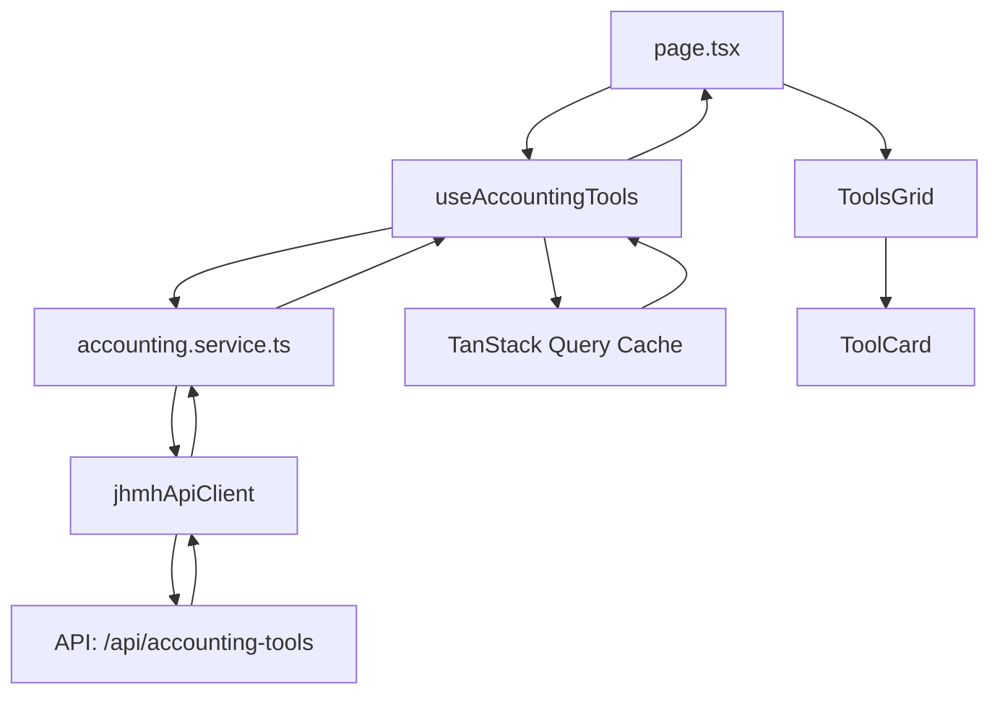

# 📊 Accounting Tools - Documentation Technique

## 🎯 Vue d'ensemble

Module de gestion des outils comptables permettant l'accès centralisé aux différents outils d'analyse financière et comptable de l'entreprise.

### Fonctionnalités principales
- **Catalogue d'outils** : Affichage des outils comptables disponibles
- **Navigation intuitive** : Accès rapide aux différents modules
- **Gestion d'états** : Loading, erreurs et états vides élégants
- **Architecture modulaire** : Feature-based avec séparation des concerns

## 🏗️ Architecture

```
src/app/home/accounting/
├── page.tsx                  # Page principale - Point d'entrée
├── components/               # Composants UI spécifiques
│   ├── ToolCard.tsx         # Carte individuelle d'outil
│   ├── ToolCardSkeleton.tsx # Skeleton pour le loading
│   ├── ToolsGrid.tsx        # Grille responsive des outils
│   └── index.ts             # Export barrel
├── config/                  # Configuration centralisée
│   ├── constants.ts         # Constantes (titres, API, cache)
│   └── index.ts            
├── hooks/                   # Logique métier réactive
│   ├── useAccountingTools.ts # Hook principal pour les outils
│   └── index.ts            
├── services/                # Couche API
│   ├── accounting.service.ts # Service de récupération des outils
│   └── index.ts            
├── types/                   # Types TypeScript
│   ├── accounting.ts        # Interfaces et types
│   └── index.ts            
└── dashboard/              # Sous-module dashboard (voir README dédié)
```

## 📦 Dépendances

### Dépendances externes
```typescript
// Composants globaux
@/components/dashboard/dashboard-layout  // Layout principal
@/components/states                      // États UI (Loading, Error, NoData)
@/components/dashboard/page-header             // En-tête standardisé

// Utilitaires
@/lib/jhmh-api                          // Client API JHMH (axios-based)
@/lib/utils                             // Fonctions utilitaires (cn)

// Bibliothèques
@tanstack/react-query                   // Gestion du cache et des requêtes
lucide-react                            // Icônes
```

### Dépendances internes
```typescript
// Configuration
./config/constants                      // PAGE_CONFIGS, BREADCRUMBS, CACHE_CONFIG

// Composants
./components/ToolsGrid                  // Grille principale
./components/ToolCard                   // Carte d'outil

// Hooks
./hooks/useAccountingTools              // Hook de données principal

// Types
./types/accounting                      // AccountingTool, AccountingToolAPIResponse
```

## 🔄 Flux de données



## 🎨 Composants

### `page.tsx`
**Responsabilité** : Page principale orchestrant l'affichage
```typescript
interface Props {
  // Aucune prop - utilise useAccountingTools
}

// États gérés
- accountingTools: AccountingTool[]
- isLoading: boolean
- error: string | null
- refetch: () => void
```

### `ToolsGrid`
**Responsabilité** : Grille responsive des outils
```typescript
interface ToolsGridProps {
  tools: AccountingTool[]
  isLoading: boolean
}

// Features
- Grille responsive (1/2/3 colonnes)
- Affichage de skeletons pendant le loading
- Mapping dynamique des icônes
```

### `ToolCard`
**Responsabilité** : Carte individuelle d'un outil
```typescript
interface ToolCardProps {
  tool: AccountingTool
  IconComponent: React.ComponentType
}

// Features
- Affichage titre/description
- Navigation vers l'outil
- Hover effects
```

## 🔌 API & Services

### Endpoint principal
```typescript
GET /api/accounting-tools

// Response
{
  success: boolean
  data: AccountingTool[]
  error?: string
}
```

### Types de données
```typescript
interface AccountingTool {
  id: string
  title: string
  description: string
  href: string
  icon?: string
  disabled?: boolean
}
```

### Configuration du cache
```typescript
CACHE_CONFIG.ACCOUNTING_TOOLS = {
  revalidate: 300,      // 5 minutes (Next.js)
  staleTime: 5 * 60 * 1000,  // 5 minutes (React Query)
  gcTime: 10 * 60 * 1000      // 10 minutes (garbage collection)
}
```

## 🎯 États de l'interface

### 1. État de chargement
- Affiche `ToolCardSkeleton` (3 cartes)
- Animation pulse pour feedback visuel

### 2. État d'erreur
- Utilise `ErrorVariants.Card` global
- Bouton "Réessayer" avec `refetch()`
- Message d'erreur contextualisé

### 3. État succès
- Affichage de la grille d'outils
- Navigation active vers chaque outil

### 4. État vide
- Géré automatiquement (tableau vide = grille vide)

## 🔧 Configuration

### Constantes principales
```typescript
PAGE_CONFIGS.ACCOUNTING = {
  title: 'Accounting Tools',
  description: 'Outils de gestion comptable...',
  errorDescription: 'Outils de gestion comptable...'
}

BREADCRUMBS.ACCOUNTING = [
  { label: 'Accueil', href: '/home' },
  { label: 'Accounting Tools' }
]
```

### Query Keys (TanStack Query)
```typescript
QUERY_KEYS.ACCOUNTING_TOOLS() // ['accounting', 'tools']
```

## 🚀 Utilisation

### Import dans une autre page
```typescript
import { useAccountingTools } from '@/app/home/accounting/hooks';

function MyComponent() {
  const { accountingTools, isLoading, error } = useAccountingTools();
  // ...
}
```

### Ajout d'un nouvel outil
1. L'API doit retourner le nouvel outil dans la liste
2. Ajouter l'icône correspondante dans `TOOL_ICONS` (ToolsGrid.tsx)
3. Le reste est automatique

### Modification du cache
Modifier dans `config/constants.ts`:
```typescript
CACHE_CONFIG.ACCOUNTING_TOOLS = {
  revalidate: 600, // 10 minutes au lieu de 5
  // ...
}
```

## 🐛 Debugging

### Points de vérification
1. **API non accessible** : Vérifier `/api/accounting-tools`
2. **Outils non affichés** : Vérifier la structure de la réponse API
3. **Cache persistant** : Invalider avec `invalidateAccountingTools()`
4. **Icônes manquantes** : Vérifier `TOOL_ICONS` dans ToolsGrid

### Logs disponibles
- API calls : Console via `api-logger.ts`
- React Query : DevTools en développement

## 📝 Conventions de code

### Imports
```typescript
// 1. External imports
import { ... } from '@/components/...';

// 2. Internal imports  
import { ... } from './components';
import { ... } from './config';
```

### Nommage
- **Composants** : PascalCase (`ToolCard`)
- **Hooks** : camelCase avec `use` (`useAccountingTools`)
- **Services** : camelCase avec verbe (`fetchAccountingTools`)
- **Types** : PascalCase (`AccountingTool`)
- **Constantes** : SCREAMING_SNAKE_CASE (`PAGE_CONFIGS`)

## 🔄 Évolutions prévues

1. **Filtrage des outils** : Par catégorie/statut
2. **Recherche** : Barre de recherche temps réel
3. **Favoris** : Système de favoris utilisateur
4. **Analytics** : Tracking des outils les plus utilisés
5. **Permissions** : Affichage conditionnel selon les droits

## ⚠️ Points d'attention après refactoring

1. **Client API unifié** : Utilise maintenant `jhmhApiClient` (axios) au lieu de `apiClient` (fetch)
2. **Composants globaux** : `MetricCard` global utilisé partout (suppression des duplications)
3. **Pas de code dupliqué** : Toutes les fonctions utilitaires sont centralisées
4. **Architecture feature-based** : Strictement respectée avec séparation des concerns

## 📚 Ressources

- [TanStack Query Docs](https://tanstack.com/query)
- [Next.js App Router](https://nextjs.org/docs/app)
- [Architecture Feature-Based](https://www.robinwieruch.de/react-folder-structure/)
