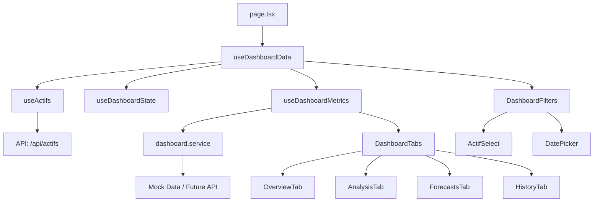

# 📈 Accounting Dashboard - Documentation Technique

## 🎯 Vue d'ensemble

Dashboard analytique avancé pour l'analyse des performances financières et comptables des actifs immobiliers. Fournit des métriques détaillées, des comparaisons temporelles et des prévisions.

### Fonctionnalités principales
- **Métriques temps réel** : KPIs financiers et opérationnels
- **Analyse comparative** : Comparaison avec périodes précédentes
- **Visualisations** : Graphiques et tableaux interactifs
- **Multi-onglets** : Vue d'ensemble, Analyse, Prévisions, Historique
- **Filtrage avancé** : Par actif et date de référence

## 🏗️ Architecture

```
src/app/home/accounting/dashboard/
├── page.tsx                    # Page principale - Orchestrateur
├── components/                 # Composants UI du dashboard
│   ├── DashboardFilters.tsx  # Filtres (actif, date)
│   ├── DashboardTabs.tsx     # Système d'onglets
│   ├── MetricCard.tsx        # Carte de métrique KPI
│   ├── PerformanceCard.tsx   # Carte de performance
│   ├── ComparisonTable.tsx   # Tableau comparatif
│   ├── tabs/                  # Composants des onglets
│   │   ├── OverviewTab.tsx   # Vue d'ensemble
│   │   ├── AnalysisTab.tsx   # Analyse détaillée
│   │   ├── ForecastsTab.tsx  # Prévisions
│   │   └── HistoryTab.tsx    # Historique
│   └── index.ts               # Export barrel
├── hooks/                      # Logique métier réactive
│   ├── useDashboardData.tsx  # Hook principal orchestrateur
│   ├── useDashboardMetrics.ts # Hook des métriques
│   ├── useDashboardState.ts  # Hook d'état local
│   └── index.ts
├── services/                   # Couche API
│   ├── dashboard.service.ts  # Service principal (mock temporaire)
│   └── index.ts
├── lib/                        # Utilitaires spécifiques
│   ├── dashboard-utils.ts    # Formatage, calculs
│   ├── date-utils.ts         # Manipulation dates
│   ├── actifs-utils.ts       # Gestion actifs
│   └── index.ts
├── types/                      # Types TypeScript
│   ├── dashboard.ts           # Interfaces complètes
│   └── index.ts
└── validation/                 # Validation des données
    ├── dashboard.validation.ts # Schémas Zod
    └── index.ts
```

## 📦 Dépendances

### Dépendances externes
```typescript
// Composants globaux
@/components/dashboard                   // DashboardLayout, PageHeader, MetricCard
@/components/states                      // États UI globaux (Loading, Error, NoData)
@/components/ui/tabs                     // Système d'onglets
@/components/ui/card                     // Cards
@/components/ui/table                    // Tables
@/components/ui/select                   // Select
@/components/ui/button                   // Buttons
@/components/ui/date-picker              // Date picker

// Hooks externes
@/app/home/exploitation/actifs/hooks/useActifs  // Liste des actifs

// Utilitaires
@/lib/jhmh-api                          // Client API JHMH (axios-based)
@/lib/utils                             // cn, formatters

// Bibliothèques
@tanstack/react-query                   // Cache et requêtes
lucide-react                            // Icônes
date-fns                                // Manipulation dates (si utilisé)
zod                                     // Validation (si utilisé)
```

### Dépendances internes
```typescript
// Configuration partagée
../config/constants                      // Utilise la config parent

// Hooks locaux
./hooks/useDashboardData                // Orchestrateur principal
./hooks/useDashboardMetrics             // Métriques

// Services
./services/dashboard.service            // Fetch des données

// Types
./types/dashboard                       // DashboardMetrics, etc.

// Utils
./lib/dashboard-utils                   // Formatage, calculs
```

## 🔄 Flux de données



## 🎨 Composants principaux

### `page.tsx`
**Responsabilité** : Orchestration et gestion d'état global
```typescript
// États gérés via useDashboardData
- filters: { date, actif }
- hasSearched: boolean
- actifs: Actif[]
- metricsData: DashboardMetricsResponse
- isLoadingMetrics: boolean
- metricsError: Error | null
```

### `DashboardFilters`
**Responsabilité** : Interface de filtrage
```typescript
interface DashboardFiltersProps {
  filters: DashboardFilters
  actifs: Actif[]
  isLoadingActifs: boolean
  isLoadingMetrics: boolean
  actifsError: Error | null
  hasSearched: boolean
  onFiltersChange: (filters: Partial<DashboardFilters>) => void
  onSearch: () => void
}

// Features
- Sélection d'actif avec recherche
- Date picker avec validation
- Bouton recherche avec états
```

### `DashboardTabs`
**Responsabilité** : Navigation par onglets
```typescript
interface DashboardTabsProps {
  metrics: DashboardMetrics
}

// Onglets disponibles
1. Vue d'ensemble - KPIs principaux
2. Analyse - Détails et comparaisons
3. Prévisions - Projections futures
4. Historique - Évolution temporelle
```

## 📊 Structure des données

### Types principaux
```typescript
interface DashboardMetrics {
  databaseStatistics: {
    databaseInfo: DatabaseInfo
    todayBusiness: TodayBusiness
    financialMetrics: FinancialMetrics
    performanceMetrics: PerformanceMetrics
  }
  comparisons: ComparisonData
  forecasts: ForecastData
  history: HistoricalData[]
}

interface MetricCardData {
  title: string
  value: string | number
  format: 'currency' | 'percentage' | 'number'
  trend?: {
    value: number
    isPositive: boolean
  }
  subtitle?: string
}
```

## 🔌 API & Services

### Endpoint principal (À CRÉER)
```typescript
POST /api/dashboard/metrics

// Request
{
  actif: string
  date: string
}

// Response
{
  success: boolean
  data: DashboardMetrics
  error?: string
}
```

### Service actuel (MOCK)
```typescript
// dashboard.service.ts utilise des données mock
// TODO: Remplacer par jhmhApiClient.post('/api/dashboard/metrics', params)
```

### Configuration du cache
```typescript
CACHE_CONFIG.DASHBOARD_METRICS = {
  revalidate: 60,              // 1 minute
  staleTime: 1 * 60 * 1000,   // 1 minute
  gcTime: 5 * 60 * 1000       // 5 minutes
}
```

## 🎯 États de l'interface

### 1. État initial (SearchEmpty)
- Utilise `NoDataVariants.SearchEmpty`
- Message d'invitation à la recherche
- Bouton "Commencer l'analyse"

### 2. État de chargement
- Utilise `LoadingVariants.DashboardSkeleton`
- Skeleton complet mimant la structure finale
- Onglets + Cards + Tables en skeleton

### 3. État d'erreur
- Utilise `ErrorVariants.Card`
- Message d'erreur contextualisé
- Bouton retry

### 4. État succès
- Affichage des onglets avec données
- Métriques formatées et colorées
- Graphiques et tableaux interactifs

### 5. État sans données
- Utilise `NoDataVariants.Criteria`
- Message explicatif
- Suggestion de modifier les critères

## 🧮 Utilitaires (lib/)

### `dashboard-utils.ts`
```typescript
// Formatage
formatCurrency(value: number): string
formatPercentage(value: number): string
formatNumber(value: number): string

// Calculs
calculateTrend(current: number, previous: number): TrendData
getComparisonColorClass(value: number): string

// Sécurité
getSafeValue(value: any, fallback?: any): any
```

### `date-utils.ts`
```typescript
formatDate(date: Date, format: string): string
isValidDate(date: string): boolean
getDateRanges(referenceDate: Date): DateRanges
```

### `actifs-utils.ts`
```typescript
formatActifName(actif: Actif): string
getActifById(actifs: Actif[], id: string): Actif | null
sortActifs(actifs: Actif[]): Actif[]
```

## 🔧 Configuration

### Constantes principales
```typescript
PAGE_CONFIGS.DASHBOARD = {
  title: 'Dashboard Accounting',
  description: 'Analysez les performances financières...'
}

BREADCRUMBS.DASHBOARD = [
  { label: 'Accueil', href: '/home' },
  { label: 'Accounting Tools', href: '/home/accounting' },
  { label: 'Dashboard' }
]
```

### Query Keys
```typescript
QUERY_KEYS.DASHBOARD_METRICS({ date, actif })
// ['accounting', 'dashboard', 'metrics', { date, actif }]
```

## 🚀 Utilisation

### Ajout d'un nouvel onglet
1. Créer le composant dans `components/tabs/`
2. L'ajouter dans `TABS_CONFIG` (DashboardTabs.tsx)
3. Importer et exporter depuis `components/index.ts`

### Modification des métriques
1. Mettre à jour les types dans `types/dashboard.ts`
2. Adapter le service dans `dashboard.service.ts`
3. Mettre à jour les composants d'affichage

### Personnalisation du cache
```typescript
// Dans config/constants.ts
CACHE_CONFIG.DASHBOARD_METRICS = {
  staleTime: 30 * 1000, // 30 secondes au lieu d'1 minute
}
```

## 🐛 Debugging

### Points de vérification
1. **Pas de données** : Vérifier les filtres (date, actif)
2. **Loading infini** : Vérifier l'API/service
3. **Erreur de format** : Vérifier `dashboard-utils.ts`
4. **Actifs non chargés** : Vérifier `useActifs` hook

### Validation des données
```typescript
// Utilise Zod pour valider
dashboardMetricsSchema.parse(data)
```

### Logs disponibles
- Filtres appliqués : Console en dev
- API calls : Via `api-logger.ts`
- React Query : DevTools

## 📝 Conventions spécifiques

### Formatage des valeurs
```typescript
// Toujours utiliser les helpers
formatCurrency(1234.56)  // "1 234,56 €"
formatPercentage(0.123)   // "12,3%"
formatNumber(1234)        // "1 234"
```

### Gestion des erreurs
```typescript
// Toujours utiliser getSafeValue
const value = getSafeValue(data?.metrics?.value, 0);
```

### Couleurs des tendances
```typescript
// Utiliser getComparisonColorClass
className={getComparisonColorClass(trend)}
// Retourne: text-green-600, text-red-600, text-gray-500
```

## 🔄 Évolutions prévues

1. **API réelle** : Remplacer les données mock
2. **Export** : Export PDF/Excel des rapports
3. **Graphiques avancés** : Charts interactifs (Chart.js)
4. **Comparaison multi-actifs** : Vue comparative
5. **Alertes** : Seuils et notifications
6. **Personnalisation** : Dashboard configurable par utilisateur
7. **Real-time** : WebSocket pour données temps réel

## ⚠️ Points d'attention

1. **Performance** : Le skeleton est lourd, optimiser si nécessaire
2. **Cache** : Durée courte (1 min) pour données fraîches
3. **Validation** : Toujours valider les données API
4. **Responsive** : Tester sur mobile (tables scrollables)
5. **Types temporaires** : `Actif` et `ActifListing` définis localement pour éviter les dépendances circulaires
6. **Fonctions refactorisées** : Toutes les fonctions dépréciées ont été remplacées par des versions simplifiées

## 📚 Ressources

- [TanStack Query - Caching](https://tanstack.com/query/latest/docs/guides/caching)
- [Zod - Validation](https://zod.dev/)
- [Date-fns - Docs](https://date-fns.org/)
- [Shadcn/ui - Components](https://ui.shadcn.com/)

*Status : Mock Data - En attente API réelle*