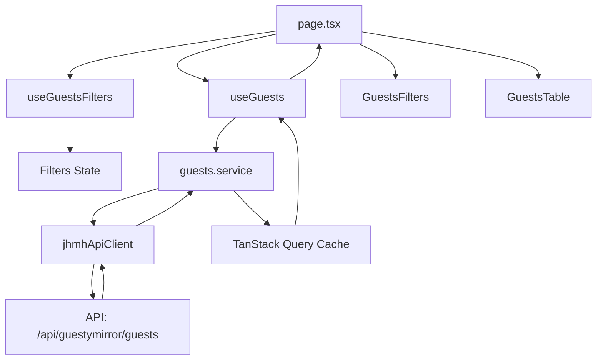

# 👥 Guests Module - Documentation Technique

## 🎯 Vue d'ensemble

Module de gestion des invités et clients permettant la consultation, la recherche et l'affichage détaillé des informations des guests.

### Fonctionnalités principales
- **Recherche avancée** : Filtrage par nom, email, téléphone, ID, code de confirmation
- **Liste paginée** : Affichage optimisé avec pagination côté serveur
- **Détails complets** : Vue détaillée de chaque invité
- **Statuts visuels** : Badges pour VIP, blacklisté, récurrent
- **Architecture modulaire** : Feature-based avec séparation des concerns

## 🏗️ Architecture

```
src/app/home/exploitation/guests/
├── page.tsx                    # Page principale - Liste des guests
├── [guestId]/                  # Route dynamique
│   └── page.tsx               # Page détails d'un guest
├── components/                 # Composants UI spécifiques
│   ├── GuestsTable.tsx        # Table avec pagination
│   ├── GuestsFilters.tsx     # Interface de filtrage
│   └── index.ts               # Export barrel
├── config/                     # Configuration centralisée
│   ├── constants.ts           # Constantes (titres, cache, API)
│   └── index.ts              
├── hooks/                      # Logique métier réactive
│   ├── useGuests.ts           # Hook principal pour la liste
│   ├── useGuestDetails.ts    # Hook pour les détails
│   ├── useGuestsFilters.ts   # Gestion des filtres
│   └── index.ts              
├── lib/                        # Utilitaires spécifiques
│   ├── guests-utils.ts       # Formatage, calculs
│   └── index.ts              
├── services/                   # Couche API
│   ├── guests.service.ts     # Service API JHMH
│   └── index.ts              
├── types/                      # Types TypeScript
│   ├── guest.ts               # Interfaces Guest
│   ├── index.ts              
└── validation/                 # Validation des données
    ├── guests.validation.ts   # Schémas Zod
    └── index.ts
```

## 📦 Dépendances

### Dépendances externes
```typescript
// Composants globaux
@/components/dashboard         // DashboardLayout, PageHeader
@/components/states           // LoadingVariants, ErrorVariants, NoDataVariants
@/components/ui               // Button, Card, Table, Input, Badge, etc.

// Stores
@/stores/loading-store        // Gestion du loading global

// Utilitaires
@/lib/jhmh-api               // Client API JHMH (axios-based)
@/lib/utils                  // cn, formatters

// Bibliothèques
@tanstack/react-query        // Cache et requêtes
lucide-react                 // Icônes
date-fns                     // Manipulation dates
zod                         // Validation
```

### Dépendances internes
```typescript
// Configuration
./config/constants           // PAGE_CONFIGS, BREADCRUMBS, CACHE_CONFIG, QUERY_KEYS

// Hooks
./hooks/useGuests           // Hook de données principal
./hooks/useGuestsFilters   // Hook de gestion des filtres
./hooks/useGuestDetails     // Hook pour détails

// Services
./services/guests.service   // API calls

// Types
./types/guest              // Guest, GuestFilters, ExternalGuestsResponse

// Utils
./lib/guests-utils         // formatPhone, formatGuestName, etc.

// Validation
./validation/guests.validation // Schémas Zod pour validation
```

## 🔄 Flux de données



## 🎨 Composants

### `page.tsx`
**Responsabilité** : Page principale orchestrant l'affichage de la liste
```typescript
// États gérés via hooks
- filters: GuestFilters (via useGuestsFilters)
- guests: Guest[] (via useGuests)
- isLoading, error, refetch (via useGuests)
```

### `GuestsTable`
**Responsabilité** : Affichage tabulaire avec pagination
```typescript
interface GuestsTableProps {
  guests: Guest[]
  currentPage: number
  pageSize: number
  total: number
  onPageChange: (page: number) => void
}

// Features
- Affichage responsive
- Pagination avancée
- Actions par ligne
- Badges de statut
```

### `GuestsFilters`
**Responsabilité** : Interface de recherche et filtrage
```typescript
interface GuestsFiltersProps {
  filters: GuestFilters
  hasActiveFilters: boolean
  activeFiltersCount: number
  showFilters: boolean
  isRefreshing: boolean
  onSearchChange: (value: string) => void
  onFilterChange: (key: keyof GuestFilters, value: any) => void
  onToggleFilters: () => void
  onResetFilters: () => void
  onRefresh: () => void
}

// Features
- Recherche temps réel
- Filtres avancés (ID, code confirmation)
- Compteur de filtres actifs
- Reset des filtres
```

## 🔌 API & Services

### Endpoint principal
```typescript
GET /api/guestymirror/guests

// Query params
- page: number
- page_size: number
- q: string (recherche)
- guest_id: string
- confirmation_code: string

// Response
{
  data: Guest[]
  error: boolean
  message: string
  meta: {
    filters_applied: Record<string, unknown>
    page: number
    page_size: number
    total: number
    total_pages: number
  }
  timestamp: string
}
```

### Types de données
```typescript
interface Guest {
  id: string
  full_name?: string
  first_name?: string
  last_name?: string
  email?: string
  phone?: string
  address?: string
  city?: string
  postal_code?: string
  country?: string
  vip_status?: boolean
  blacklisted?: boolean
  is_returning?: boolean
  // ... et plus
}

interface GuestFilters {
  q: string
  page: number
  page_size: number
  guest_id?: string
  confirmation_code?: string
}
```

### Configuration du cache
```typescript
CACHE_CONFIG.GUESTS = {
  revalidate: 60,            // 1 minute (Next.js)
  staleTime: 1 * 60 * 1000,  // 1 minute (React Query)
  gcTime: 5 * 60 * 1000     // 5 minutes (garbage collection)
}
```

## 🎯 États de l'interface

### 1. État de chargement
- Utilise `LoadingVariants.Data`
- Affichage d'un spinner avec message

### 2. État d'erreur
- Utilise `ErrorVariants.Card`
- Message d'erreur contextualisé
- Bouton "Réessayer"

### 3. État sans données
- `NoDataVariants.Criteria` si filtres actifs
- `NoDataVariants.Empty` sinon
- Messages appropriés selon le contexte

### 4. État succès
- Affichage de la table avec pagination
- Badges de statut pour chaque guest
- Actions disponibles par ligne

## 🧮 Utilitaires (lib/)

### `guests-utils.ts`
```typescript
// Formatage
formatPhone(phone: string): string          // Format téléphone FR
formatGuestName(guest: Guest): string       // Nom complet
formatAddress(guest: Guest): string         // Adresse complète
getGuestInitials(guest: Guest): string      // Initiales pour avatar

// Statuts
getGuestStatusColor(guest: Guest): BadgeInfo // Couleur badge selon statut

// Filtres
hasActiveFilters(filters: GuestFilters): boolean
countActiveFilters(filters: GuestFilters): number
buildGuestQueryParams(filters: GuestFilters): URLSearchParams
```

## 🔧 Configuration

### Constantes principales
```typescript
PAGE_CONFIGS.GUESTS = {
  title: 'Guests Management',
  description: 'Consultez et gérez les informations des invités...'
}

BREADCRUMBS.GUESTS = [
  { label: 'Accueil', href: '/home' },
  { label: 'Exploitation', href: '/home/exploitation' },
  { label: 'Guests' }
]

BREADCRUMBS.GUEST_DETAILS = (guestName?: string) => [
  // ... breadcrumbs avec nom dynamique
]
```

### Query Keys (TanStack Query)
```typescript
QUERY_KEYS.GUESTS(filters) // ['guests', 'list', filters]
QUERY_KEYS.GUEST_DETAILS(guestId) // ['guests', 'details', guestId]
```

## 🚀 Utilisation

### Import dans une autre page
```typescript
import { useGuests } from '@/app/home/exploitation/guests/hooks';

function MyComponent() {
  const { guests, isLoading, error } = useGuests(filters);
  // ...
}
```

### Ajout d'un nouveau filtre
1. Ajouter le champ dans `GuestFilters` (types/guest.ts)
2. Mettre à jour `buildGuestQueryParams` (lib/guests-utils.ts)
3. Ajouter l'UI dans `GuestsFilters` component
4. Valider avec Zod si nécessaire (validation/guests.validation.ts)

### Personnalisation du cache
```typescript
// Dans config/constants.ts
CACHE_CONFIG.GUESTS = {
  staleTime: 30 * 1000, // 30 secondes au lieu d'1 minute
}
```

## 🐛 Debugging

### Points de vérification
1. **Pas de données** : Vérifier les filtres appliqués
2. **Loading infini** : Vérifier l'API /api/guestymirror/guests
3. **Erreur de format** : Vérifier `guests-utils.ts`
4. **Cache persistant** : Invalider avec `invalidateGuests()`

### Validation des données
```typescript
// Utilise Zod pour valider
import { validateGuest, validateGuestsResponse } from './validation';

const validatedGuest = validateGuest(data);
```

### Logs disponibles
- API calls : Console via jhmhApiClient
- React Query : DevTools en développement

## 📝 Conventions de code

### Imports
```typescript
// 1. External imports
import { ... } from '@/components/...';
import { ... } from '@/lib/...';

// 2. Internal imports  
import { ... } from './components';
import { ... } from './hooks';
import { ... } from './config';
```

### Nommage
- **Composants** : PascalCase (`GuestsTable`)
- **Hooks** : camelCase avec `use` (`useGuests`)
- **Services** : camelCase avec verbe (`fetchJhmhGuests`)
- **Types** : PascalCase (`Guest`, `GuestFilters`)
- **Constantes** : SCREAMING_SNAKE_CASE (`PAGE_CONFIGS`)
- **Utils** : camelCase descriptif (`formatPhone`)

## 🔄 Évolutions prévues

1. **Export** : Export CSV/Excel de la liste
2. **Actions bulk** : Sélection multiple et actions groupées
3. **Historique** : Tracking des modifications
4. **Notes** : Système de notes et commentaires
5. **Tags** : Gestion avancée des tags
6. **Intégration** : Liaison avec réservations

## ⚠️ Points d'attention après refactoring

1. **React Query** : Utilisation systématique pour le data fetching
2. **Composants globaux** : Utilisation des états LoadingVariants, ErrorVariants, NoDataVariants
3. **ResultsContainer standardisé** : Utilise le composant global `@/components/dashboard/ResultsContainer` pour une UX uniforme
4. **Validation Zod** : Schémas disponibles pour validation stricte
5. **Utils centralisés** : Toutes les fonctions de formatage dans lib/
6. **Architecture feature-based** : Module complètement autonome
7. **Styles cohérents** : Même apparence que le dashboard accounting (LoadingVariants.DashboardSkeleton, NoDataVariants.SearchEmpty)

## 📚 Ressources

- [TanStack Query Docs](https://tanstack.com/query)
- [Next.js App Router](https://nextjs.org/docs/app)
- [Zod Validation](https://zod.dev/)
- [Architecture Feature-Based](https://www.robinwieruch.de/react-folder-structure/)

*Status : Production Ready - API JHMH intégrée*